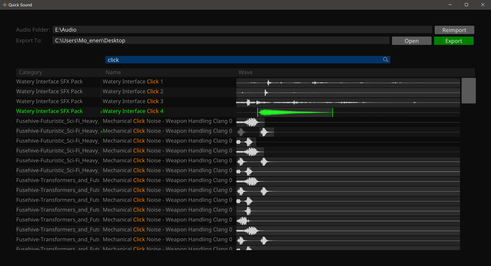

# Quick Sound

> A light weight audio sample browser for PC. Search audio file with file name. Play and crop sound. Export cropped sound wave.

### Screenshot

### Download

- [Releases Section](https://github.com/Mo-enen/QuickSound/releases)

### Changes

`v1.0.3`

- Highlight searching keyword in sound name.
- Fix bug: hint messages don't display.

`v1.0.2`

- Search with `-` to remove keyword from result. Search "wind -windy" will show all sound files with "wind" but no "windy" in their name.

`v1.0.1`

- Fix Raylib music stream issue #4521. Seek music stream to 0 will not make it goes to the end. Detail: [raysan5/raylib#4523](https://github.com/raysan5/raylib/pull/4523)
- Larger wave preview cache. (from 256 to 1024)
- Better search result UI. Significantly reduce CPU usage for large result count.

`v1.0.0`

- First release